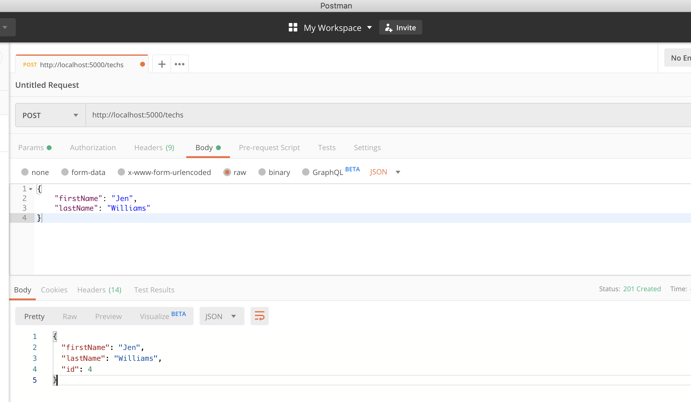

# it-logger-redux

## Run the app
- `npm install`
- `npm run dev`

## Dependencies/Setup
- `npx create-react-app .`
- `npm i -D json-server concurrently` <!-- dev dependencies: json-server: a fake REST API; concurrently: runs both server and frontend -->
- add to package.json scripts: `"json-server": "json-server --watch db.json --port 5000",` and `"dev": "concurrently \"npm start\" \"npm run json-server\"",` <!-- setting mock database as db.json file -->
- setup `proxy` by adding `, "proxy": "http://localhost:5000"` to `package.json` <!-- to shorten routes in code, i.e. "/" vs "http://localhost:5000/" -->
- `npm i materialize-css` <!-- less code / lightweight compared to material-ui; quick css setup -->
- `npm i moment react-moment` <!-- process dates -->

## Testing routes with Postman

- mock database is in `db.json` file
- Complete CRUD functionality from `json-server`...

- GET `http://localhost:5000/logs` -> shows logs data

- GET `http://localhost:5000/techs` -> shows techs data

- POST `http://localhost:5000/techs`, Headers: Key: `Content-Type`, Value: `application/json`, Body: 
```
{
	"firstName": "Jen",
	"lastName": "Williams"
}
```
The response from `json-server` auto-add&increments the id to: 
```
{
  "firstName": "Jen",
  "lastName": "Williams",
  "id": 4
}
```
This new tech is added to the `db.json` file

- PUT `http://localhost:5000/techs/4`, Headers: Key: `Content-Type`, Value: `application/json`, Body: 
```
{
	"firstName": "CHANGED NAME",
	"lastName": "Williams"
}
```

- DELETE `http://localhost:5000/techs/4` -> deletes tech with "id": 4